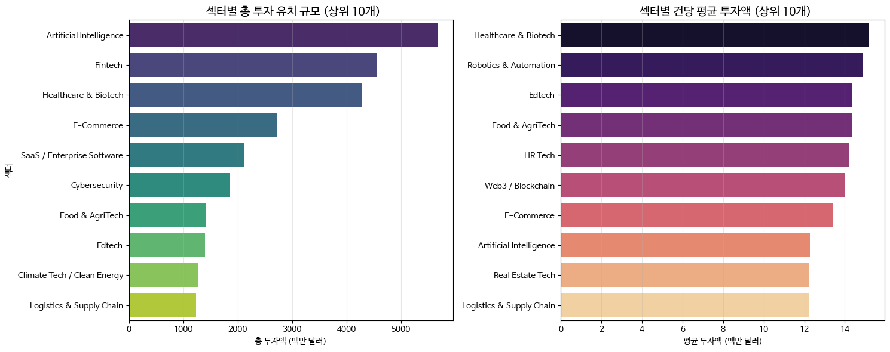
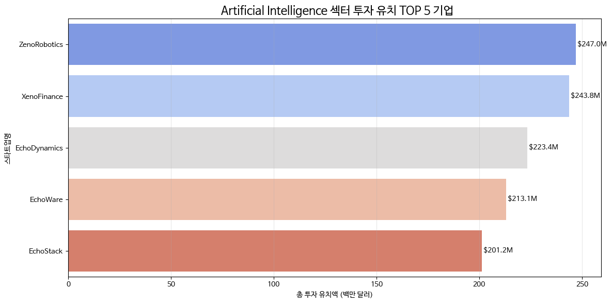

# 🏷 글로벌 스타트업 투자 트렌드 분석: 누가 AI 시장을 주도하는가?

> 2,820건의 글로벌 투자 라운드 데이터를 분석하여 자본의 흐름과 AI 섹터의 압도적인 성장을 파헤쳤습니다.


---

## 🛠 사용 기술

`Python` `pandas` `matplotlib` `seaborn` `Google Colab`

## 🔑 핵심 인사이트 3줄 요약

- 💡 **AI 섹터의 압도적 점유**: 전체 투자 섹터 중 인공지능(AI) 분야가 투자 규모 및 건수에서 1위를 기록했습니다.
- 💡 **승자 독식 현상**: AI 섹터 내 상위 10% 기업이 전체 섹터 투자액의 약 60% 이상을 점유하는 집중도를 보였습니다.
- 💡 **글로벌 투자 허브**: 북미와 아시아 지역이 전체 투자의 약 70%를 차지하며 강력한 테크 생태계를 유지하고 있습니다.

## 🔗 링크

- 📓 [코랩 노트북 보기](https://colab.research.google.com/drive/1lPVn04ROsi57GnJSE3k-gjC3AxBKTIKZ?usp=sharing)
- 🐙 [GitHub 레포지토리](https://github.com/HaquHyup/startup-funding-analysis)

---

## 1️⃣ 문제 정의 & 기대효과

### 왜 이 분석을 시작했나요?

급변하는 글로벌 스타트업 시장에서 자본이 어디로 흘러가는지 파악하는 것은 투자자와 창업자 모두에게 필수적입니다. 특히 최근 AI 광풍이 실제 수치로 어떻게 나타나고 있는지 확인하고자 했습니다.

### 이걸 해결하면 뭐가 좋아지나요?

- **투자자**: 과열된 섹터와 유망한 버티컬 영역을 구분하여 효율적인 포트폴리오 전략 수립 가능
- **창업자**: 시장의 벤치마크(평균 투자액, 밸류에이션)를 파악하여 현실적인 펀드레이징 목표 설정 가능

---

## 2️⃣ 데이터 요약

| 항목        | 내용                                       |
| ----------- | ------------------------------------------ |
| 데이터 출처 | Kaggle Startup Funding Dataset             |
| 데이터 기간 | 2020.01 ~ 2026.03                          |
| 행/열 수    | 2,820행 × 18열                            |
| 주요 컬럼   | amount, sector, stage, lead_investor, region |

---

## 3️⃣ 분석 프로세스

```
[데이터 수집] → [데이터 파악] → [가설 설정] → [데이터 분석] → [시각화/리포팅]
    ↓             ↓          ↓          ↓            ↓           ↓
   CSV 로드      행/열/결측치   AI 주도설     Pivot/Groupby   Seaborn/Insights
```

---

## 4️⃣ 주요 수행 역할

- ✅ **데이터 전처리**: 2,800여 건의 결측치 처리 및 투자 금액 단위(Million USD) 통일
- ✅ **EDA**: 섹터별, 지역별 투자 분포 및 시계열 트렌드 분석
- ✅ **Deep-Dive**: AI 섹터 내 대장주 기업과 리드 투자자 간의 상관관계 분석
- ✅ **시각화 & 인사이트**: 비개발자도 한눈에 이해할 수 있는 대시보드형 차트 제작

---

## 5️⃣ 분석 내용

### 📊 분석 1: 섹터별 투자 유치 규모 TOP 10



**👉 발견한 것**:  
인공지능(AI) 섹터가 전체 투자액에서 압도적 1위를 차지했습니다. 핀테크와 헬스케어가 뒤를 이었으나, AI는 성장 기울기가 훨씬 가파른 것으로 나타났습니다.

**🔍 왜 그럴까?**:  
LLM(거대언어모델)의 등장 이후 인프라 및 서비스 계층에 대한 천문학적인 투자가 집중되었기 때문으로 해석됩니다.

---

### 📊 분석 2: AI 섹터 내 자본 쏠림 현상



**👉 발견한 것**:  
AI 섹터 내에서도 '승자 독식' 현상이 뚜렷합니다. 상위 몇 개의 유니콘 기업들이 전체 자본의 상당 부분을 흡수하고 있으며, 이는 초기 단계 스타트업에게는 진입 장벽으로 작용할 수 있습니다.

**🔍 왜 그럴까?**:  
컴퓨팅 자원 확보를 위한 대규모 자본이 필수적인 AI 산업 특성상, 검증된 대형 플레이어에게 자금이 몰리는 경향이 있습니다.

---

## 6️⃣ 결론 & 전략적 제안

### 🎯 결론

현재 스타트업 시장은 AI를 중심으로 재편되고 있으며, 자본은 검증된 기술력과 확장성을 가진 상위 플레이어에게 집중되고 있습니다.

### 💼 전략적 제안 (Action Items)

1. **[투자자]**: 이미 자본이 쏠린 제너럴 AI보다는, 특정 산업(의료, 법률 등)에 특화된 **'버티컬 AI'** 초기 기업 발굴에 집중할 것
2. **[창업자]**: 단순 기술 나열보다는 글로벌 TOP VC가 선호하는 **'플랫폼 확장성'**과 **'수익 모델'**을 데이터로 증명해야 함
3. **[구직자]**: 자본이 집중되는 북미/아시아의 테크 허브 기반 AI 스타트업에서 커리어를 시작하는 것이 유리함

---

## 7️⃣ Lesson & Learned

### 🛠 기술적으로 배운 것

- Pandas의 `pivot_table`과 `groupby`를 활용해 대규모 시계열 데이터를 다각도로 분석하는 역량을 길렀습니다.
- Matplotlib 한글 폰트 최적화 및 Seaborn의 테마 커스터마이징을 통해 가독성 높은 시각화 자료를 제작했습니다.

### 💡 분석가로서 배운 것

- 데이터는 단순한 숫자가 아니라 **'시장의 목소리'**임을 깨달았습니다. "왜 이 섹터에 돈이 몰리는가?"를 질문하며 도메인 지식과 결합하는 과정의 중요성을 배웠습니다.

---

## 📚 참고 자료

- [Kaggle Startup Funding Dataset](https://www.kaggle.com/)
- [Global VC Trend Report 2024]

---

#데이터분석 #스타트업 #투자트렌드 #Python #AI #포트폴리오
